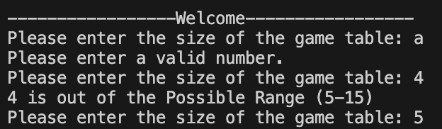
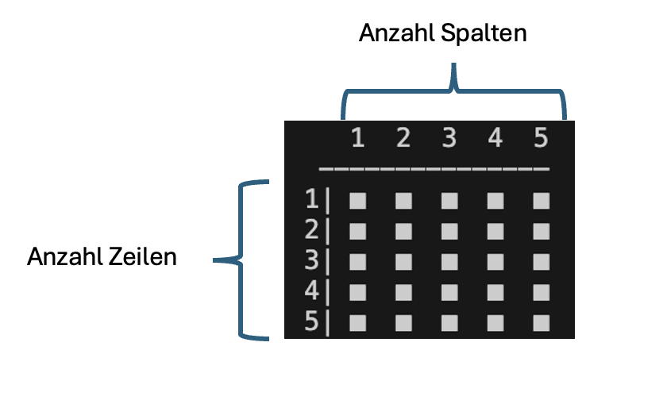
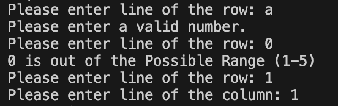
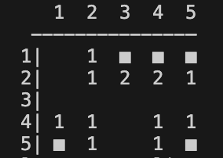
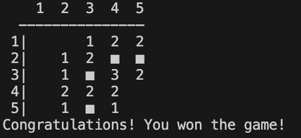
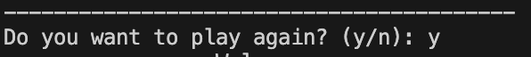
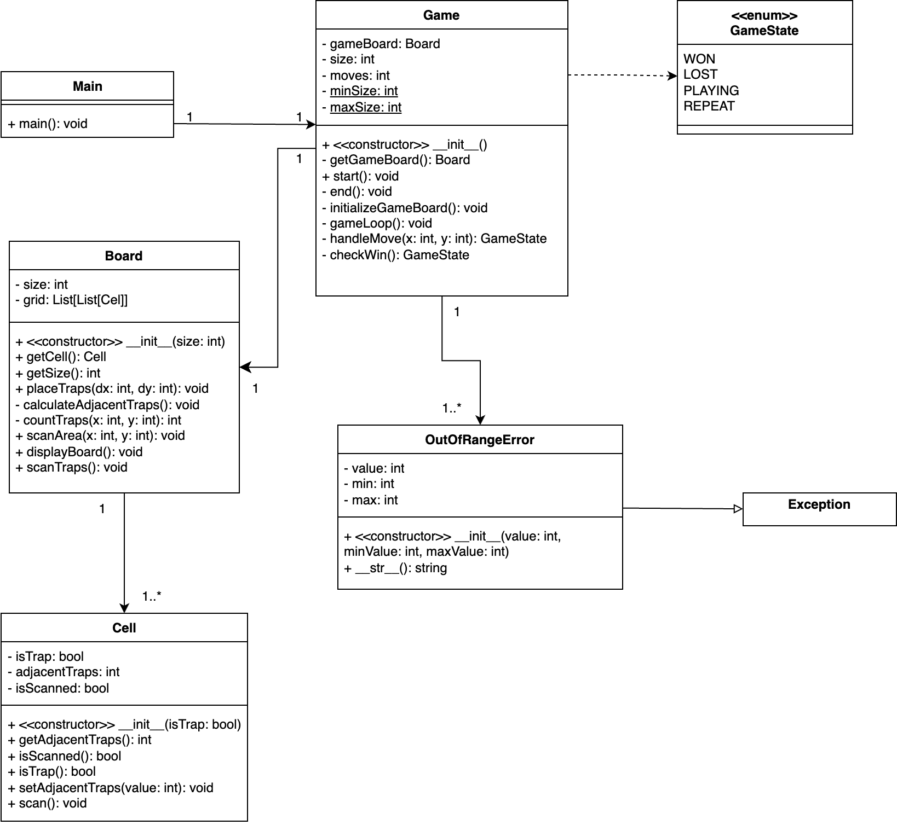

# Dokumentation

## 1. Grundlegender Aufbau des Spiels
 
 ### Beschreibung UI
 <table style ="padding-bottom: 100px;">
  <tr>
    <td style="border: none; width: 320px;"></td>
    <td style="border: none;"> Als erstes soll man  die Größe des Spielfelds eingeben, dabei wird die Eingabe auf ungültige Eingaben überprüft und der Benutzer passend über eine falsche Eingabe informiert. Eine falsche Eingabe ist dann der Fall, wenn der Benutzer keine Zahl eingibt, oder keine Zahl zwischen 5 und 15.</td>
  </tr>
  <tr>
    <td style="border: none;"></td>
    <td style="border: none;">Hier wird das Spielfeld ausgegeben. Die nicht aufgedeckten Felder sind hierbei ein ■ und über den Feldern wird die Zeilen-/Spaltennummer angezeigt, sodass der Benutzer leichter ein Feld auswählen kann.</td>
  </tr>
  <tr>
    <td style="border: none;"></td>
    <td style="border: none;">Hier soll der Benutzer die Zeilen-/Spaltennummer eingeben, von dem Feld, welches er auswählen möchte. Es wird außerdem wieder auf falsche Eingaben hingewiesen.</td>
  </tr>
  <tr>
    <td style="border: none;"></td>
    <td style="border: none;">Hier wird das aktualisierte Spielfeld angezeigt. Die Zahlen stehen für die Anzahl der Fallen, welche das Feld um sich herum hat. Dabei kommt dazu, dass es leere Felder gibt, da sie keine Fallen um sich herum haben und somit eigentlich eine 0 sind.</td>
  </tr>
  <tr>
    <td style="border: none;"></td>
    <td style="border: none;">Hier wird das Spielfeld angezeigt, wenn man eine Fallen getroffen hat. Dabei werden alle übrigen Fallenfelder angezeigt und der Benutzer darüber informiert, dass er verloren hat.</td>
  </tr>
  <tr>
    <td style="border: none;"></td>
    <td style="border: none;">Hier wird das Spielfeld angezeigt, wenn man alle freien Felder aufgedeckt hat und somit das Spield gewonnen hat.</td>
  </tr>
  <tr>
    <td style="border: none;"></td>
    <td style="border: none;">Hier wird der finale Schritt gezeigt, bei der gefragt wird ob der Benutzer erneut spielen möchte oder nicht. Fall er möchte und 'y' eingibt, geht das Spiel von vorne los. Falls er 'n' eingibt, wird das Spiel beendet.</td>
  </tr>
 </table>

---

 ## Klassendiagramm

---

## Erklärung der einzelnen Klassen und deren Methoden

### **`main.py` **

Hier ist der Einstiegspunkt für das Spiel. Es wird ein `Game`-Objekt erstellt und das Spiel gestartet.

---

### **Methodenbeschreibung**

#### **`main() -> None`**
- **Beschreibung:**  
  Startet das Spiel, indem ein `Game`-Objekt erstellt und dessen `start()`-Methode aufgerufen wird.

- **Effekt:**  
  - Erstellt eine Instanz der `Game`-Klasse.  
  - Ruft die `start()`-Methode auf, um das Spiel zu starten.  

---

### **Klasse `Game`**

Die Klasse `Game` verwaltet die Spiellogik des Spiels. Sie steuert den Ablauf, verarbeitet Spielzüge und überwacht den Spielstatus.

- **(Klassen-)Attribute:**  
  - `minSize` (*int*): Minimale Spielfeldgröße (5).
  - `maxSize` (*int*): Maximale Spielfeldgröße (15).  
---

### **Methodenbeschreibung**

#### **`__init__(self) -> None`**
Initialisiert eine neue Instanz des Spiels.

- **Beschreibung:**  
  Erstellt ein neues Spielobjekt mit Standardwerten.

- **Effekt:**  
  - Setzt `minSize` und `maxSize` für die Spielfeldgröße.  
  - Initialisiert `_gameBoard` auf `None`.  
  - Setzt `_size` auf `0` und `_moves` auf `0`.  

- **Attribute:**  
  - `_gameBoard` (*Board | None*): Referenz auf das Spielfeld (`None`, falls nicht initialisiert).  
  - `_size` (*int*): Größe des Spielfelds.  
  - `_moves` (*int*): Anzahl der bereits ausgeführten Züge.  

---

#### **`_getGameBoard(self) -> Board`**
- **Beschreibung:**  
  Gibt das aktuelle Spielfeld zurück.

- **Effekt:**  
  - Falls `_gameBoard` nicht initialisiert ist, wird eine `AssertionError` ausgelöst.  

- **Rückgabewert:**  
  - `Board` – Gibt das Spielfeld-Objekt zurück.

---

#### **`start(self) -> None`**
- **Beschreibung:**  
  Startet das Spiel und beginnt die Spielschleife.

- **Effekt:**  
  - Zeigt eine Willkommensnachricht an.  
  - Initialisiert das Spielfeld.  
  - Ruft die Hauptspiel-Schleife (`_gameLoop`) auf.  

---

#### **`_end(self) -> None`**
- **Beschreibung:**  
  Beendet das aktuelle Spiel.

- **Effekt:**  
  - Fragt den Spieler, ob er erneut spielen möchte.  
  - Startet ein neues Spiel oder beendet das Programm je nach Nutzereingabe.  

---

#### **`_initializeGameBoard(self) -> None`**
- **Beschreibung:**  
  Erstellt das Spielfeld basierend auf der Nutzereingabe.

- **Effekt:**  
  - Fragt den Nutzer nach der gewünschten Spielfeldgröße.  
  - Überprüft die Eingabe auf Gültigkeit.  
  - Erstellt ein `Board`-Objekt mit der gewählten Größe.  

---

#### **`_gameLoop(self) -> None`**
- **Beschreibung:**  
  Führt die Hauptspiel-Schleife aus.

- **Effekt:**  
  - Fragt den Nutzer nach einer Zelle zum Aufdecken.  
  - Überprüft die Eingabe auf Gültigkeit.  
  - Führt den Zug mit `_handleMove` aus.  
  - Überprüft den Spielstatus (gewonnen/verloren).  
  - Falls das Spiel endet, wird `_end()` aufgerufen.  

---

#### **`_handleMove(self, x: int, y: int) -> GameState`**
- **Beschreibung:**  
  Führt einen Spielzug an der angegebenen Position aus.

- **Effekt:**  
  - Überprüft, ob die gewählte Zelle bereits aufgedeckt wurde.  
  - Falls eine Falle getroffen wurde, verliert der Spieler (`GameState.LOST`).  
  - Falls keine Falle vorhanden ist, wird das Spielfeld aktualisiert.  
  - Prüft, ob der Spieler gewonnen hat.  

- **Parameter:**  
  - `x` (*int*): X-Koordinate der gewählten Zelle.  
  - `y` (*int*): Y-Koordinate der gewählten Zelle.  

- **Rückgabewert:**  
  - `GameState` – Aktueller Spielstatus (`WON`, `LOST`, `PLAYING`, `REPEAT`).

---

#### **`_checkWin(self) -> GameState`**
- **Beschreibung:**  
  Überprüft, ob der Spieler das Spiel gewonnen hat.

- **Effekt:**  
  - Prüft, ob alle sicheren Zellen aufgedeckt wurden.  
  - Gibt `GameState.WON` zurück, falls das Spiel gewonnen wurde.  
  - Gibt `GameState.PLAYING` zurück, falls noch sichere Zellen übrig sind.  

- **Rückgabewert:**  
  - `GameState` – Entweder `WON` oder `PLAYING`.

---

### **Klasse `Board`**

Die Klasse `Board` repräsentiert das Spielfeld des Spiels. Sie verwaltet die Spielfeldzellen, platziert Fallen und ermöglicht das Aufdecken von Zellen.

---

### **Methodenbeschreibung**

#### **`__init__(self, size: int) -> None`**
Initialisiert ein neues Spielfeld mit der gegebenen Größe.

- **Beschreibung:**  
  Erstellt ein quadratisches Spielfeld mit der angegebenen Größe.

- **Attribute:**  
  - `_size` (*int*): Die Größe des Spielfelds.  
  - `_grid` (*list[list[Cell]]*): 2D-Liste, die die Spielfeldzellen speichert.  

- **Parameter:**  
  - `size` (*int*): Seitenlänge des Spielfelds.  

---

#### **`getCell(self, x: int, y: int) -> Cell`**
- **Beschreibung:**  
  Gibt die Zelle an den angegebenen Koordinaten zurück.

- **Effekt:**  
  - Falls die Koordinaten außerhalb des Spielfelds liegen, wird eine `IndexError` ausgelöst.  

- **Parameter:**  
  - `x` (*int*): X-Koordinate der Zelle.  
  - `y` (*int*): Y-Koordinate der Zelle.  

- **Rückgabewert:**  
  - `Cell` – Die Zelle an den gegebenen Koordinaten.  

---

#### **`getSize(self) -> int`**
- **Beschreibung:**  
  Gibt die Größe des Spielfelds zurück.

- **Rückgabewert:**  
  - `int` – Die Seitenlänge des Spielfelds.  

---

#### **`placeTraps(self, dx: int, dy: int) -> None`**
- **Beschreibung:**  
  Platziert Fallen zufällig auf dem Spielfeld.

- **Effekt:**  
  - Stellt sicher, dass die erste aufgedeckte Zelle keine Falle enthält.  
  - Wählt zufällig Zellen aus und setzt sie als Fallen.  
  - Aktualisiert die Nachbarzellen mit der Anzahl angrenzender Fallen.  

- **Parameter:**  
  - `dx` (*int*): X-Koordinate der ersten aufgedeckten Zelle.  
  - `dy` (*int*): Y-Koordinate der ersten aufgedeckten Zelle.  

---

#### **`_calculateAdjacentTraps(self) -> None`**
- **Beschreibung:**  
  Berechnet für jede Zelle die Anzahl angrenzender Fallen.

- **Effekt:**  
  - Setzt für jede nicht-Falle die Anzahl benachbarter Fallen.  

---

#### **`_countTraps(self, x: int, y: int) -> int`**
- **Beschreibung:**  
  Zählt die Anzahl der Fallen in den Nachbarzellen.

- **Effekt:**  
  - Durchsucht alle benachbarten Zellen und zählt die Fallen.  

- **Parameter:**  
  - `x` (*int*): X-Koordinate der Zelle.  
  - `y` (*int*): Y-Koordinate der Zelle.  

- **Rückgabewert:**  
  - `int` – Anzahl der angrenzenden Fallen.  

---

#### **`scanArea(self, x: int, y: int) -> None`**
- **Beschreibung:**  
  Deckt leere Felder auf und breitet sich rekursiv aus.

- **Effekt:**  
  - Falls die Zelle bereits aufgedeckt wurde, passiert nichts.  
  - Falls die Zelle keine angrenzenden Fallen hat, werden benachbarte Zellen rekursiv aufgedeckt.  

- **Parameter:**  
  - `x` (*int*): X-Koordinate der zu scannenden Zelle.  
  - `y` (*int*): Y-Koordinate der zu scannenden Zelle.  

---

#### **`displayBoard(self) -> None`**
- **Beschreibung:**  
  Gibt das aktuelle Spielfeld in der Konsole aus.

- **Effekt:**  
  - Zeigt das Spielfeld mit Zeilen- und Spaltennummern zur besseren Orientierung an.  
  - Aufgedeckte Zellen werden mit ihrer Anzahl angrenzender Fallen angezeigt.  
  - Fallen werden als `*` dargestellt, wenn sie aufgedeckt wurden.  
  - Nicht aufgedeckte Zellen werden als `■` angezeigt.  
  - Falls eine leere Zelle keine angrenzenden Fallen hat, wird sie als Leerzeichen dargestellt.  

---

#### **`scanTraps(self) -> None`**
- **Beschreibung:**  
  Deckt alle Fallen auf dem Spielfeld auf.

- **Effekt:**  
  - Markiert alle Fallen als aufgedeckt.  
  - Aktualisiert die Anzeige des Spielfelds.  

---

### ** Klasse `Cell`**

Die Klasse `Cell` repräsentiert eine einzelne Zelle im Spielfeld (`gameBoard`). Sie speichert Informationen darüber, ob eine Zelle eine Falle ist, ob sie schon aufgedeckt wurde und wie viele Fallen sich in ihrer direkten Nachbarschaft befinden.

### **Methodenbeschreibung**

#### **`__init__(self, isTrap: bool = False)`**
Initialisiert eine Zelle. (Konstruktur)
- **Parameter:**
  - `isTrap` (*bool*): Gibt an, ob die Zelle eine Falle enthält (Standard: `False`).
- **Attribute:**
  - `_isTrap` (*bool*): Speichert, ob die Zelle eine Falle ist.
  - `_adjacentTraps` (*int*): Speichert die Anzahl der Fallen in den benachbarten Zellen (Standard: `0`).
  - `_isScanned` (*bool*): Gibt an, ob die Zelle bereits aufgedeckt wurde (Standard: `False`).

---

#### **`getAdjacentTraps(self) -> int`**
- **Beschreibung:** Gibt die Anzahl der Fallen zurück, die sich in den direkt benachbarten Zellen befinden.
- **Rückgabewert:** *int* – Anzahl der benachbarten Fallen.

---

#### **`isScanned(self) -> bool`**
- **Beschreibung:** Prüft, ob die Zelle bereits aufgedeckt wurde.
- **Rückgabewert:** *bool* – `True`, wenn die Zelle bereits gescannt wurde, sonst `False`.

---

#### **`isTrap(self) -> bool`**
- **Beschreibung:** Prüft, ob die Zelle eine Falle ist.
- **Rückgabewert:** *bool* – `True`, wenn die Zelle eine Falle enthält, sonst `False`.

---

#### **`setAdjacentTraps(self, value: int) -> None`**
- **Beschreibung:** Setzt die Anzahl der Fallen in benachbarten Zellen.
- **Parameter:**
  - `value` (*int*): Die Anzahl der angrenzenden Fallen.

---

#### **`scan(self) -> None`**
- **Beschreibung:** Markiert die Zelle als aufgedeckt.
- **Effekt:** Setzt `_isScanned` auf `True`, sodass die Zelle nicht erneut aufgedeckt werden kann.

---

## **Klasse `OutOfRangeError`**

Die Klasse

---

## **Methodenbeschreibung**

### **`__init__(self, value: int, minValue: int, maxValue: int) -> None`**
- **Beschreibung:**  
  Die Klasse `OutOfRangeError` ist für den Fehler, der ausgelöst wird, wenn eine Eingabe außerhalb des erlaubten Wertebereichs liegt.

- **Parameter:**  
  - `value` (*int*): Der ungültige Wert.  
  - `minValue` (*int*): Die minimale erlaubte Grenze.  
  - `maxValue` (*int*): Die maximale erlaubte Grenze.  

- **Attribute:**  
  - `_value` (*int*): Speichert den ungültigen Wert.  
  - `_min` (*int*): Speichert die untere Grenze des gültigen Bereichs.  
  - `_max` (*int*): Speichert die obere Grenze des gültigen Bereichs.  

---

### **`__str__(self) -> str`**
- **Beschreibung:**  
  Gibt eine formatierte Fehlermeldung zurück, die angibt, dass der Wert außerhalb des gültigen Bereichs liegt.

- **Rückgabewert:**  
  - *str* – Fehlermeldung im Format `"<Wert> is out of the Possible Range (<min>-<max>)"`  

---

