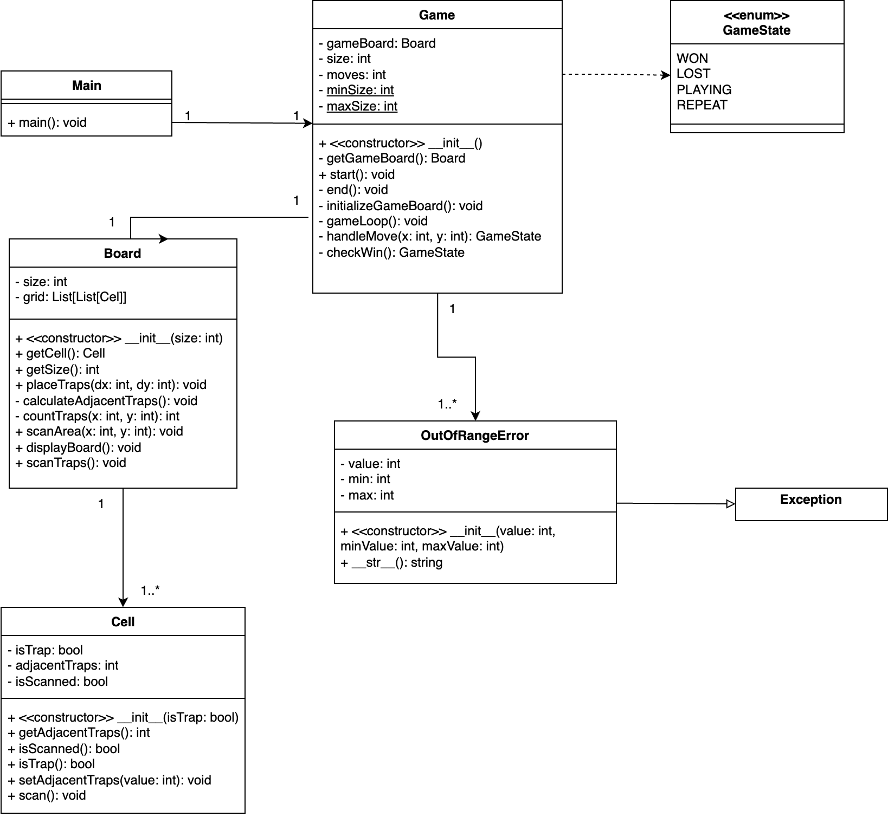

# Dokumentation

## 2. Funktionale Beschreibung des Spiels
- **Spielziel:** Der Spieler muss das gesamte Spielfeld aufdecken, ohne auf eine Falle zu stoßen.
- **Spielregeln:**
  - Das Spielfeld besteht aus einer quadratischen Anordnung von Zellen.
  - Einige Zellen enthalten Fallen, die zufällig platziert werden.
  - Der Spieler kann Felder aufdecken, die entweder sicher sind oder eine Falle enthalten.
  - Die Zahl auf einem aufgedeckten Feld gibt an, wie viele Fallen sich in direkter Nachbarschaft befinden.
  - Das Spiel endet, wenn der Spieler eine Falle aufdeckt (Verlust) oder alle sicheren Felder aufgedeckt hat (Gewinn).
- **Spielablauf:**
  1. Der Spieler wählt eine Zelle aus, um sie aufzudecken.
  2. Falls die Zelle sicher ist, wird sie aufgedeckt und ggf. benachbarte sichere Felder ebenfalls.
  3. Falls die Zelle eine Falle enthält, ist das Spiel verloren.
  4. Der Spieler wiederholt die Schritte, bis das Spiel endet.

## 3. Grundlegender Aufbau des Spiels
 ### Klassendiagramm

## 4. Verwendete Bibliotheken und deren Versionen
- `sys` (integriert)
- `random` (integriert)
- `enum` (integriert)
- **Externe Tools zur Codequalitätsprüfung:** `pylint`, `mypy`, `unittest`, `coverage`

## 5. Architekturbeschreibung
- **Komponenten:** 
  - Die `Game`-Klasse steuert das gesamte Spiel.
  - Die `Board`-Klasse verwaltet das Spielfeld und die Platzierung der Fallen.
  - Die `Cell`-Klasse speichert Informationen zu einzelnen Zellen.
- **Schichtenmodell:**
  - **Präsentation:** Konsolenausgabe zur Benutzerinteraktion.
  - **Logik:** Spiellogik, Platzierung der Fallen und Spielmechaniken.
  - **Daten:** Speicherung von Spielfeldinformationen.

## 6. Beschreibung des Nutzerinterfaces
- **Benutzereingaben:**
  - Der Spieler gibt Koordinaten ein, um Zellen aufzudecken.
  - Eingaben werden über `input()` gesammelt.
- **Ausgaben:**
  - Das Spielfeld wird als ASCII-Darstellung in der Konsole ausgegeben.
  - Hinweise und Fehlermeldungen werden textuell dargestellt.
- **Interaktionsablauf:**
  - Der Spieler wählt eine Zelle durch Koordinateneingabe.
  - Das Spielfeld aktualisiert sich entsprechend der gewählten Aktion.
  - Nach Spielende wird der Spieler gefragt, ob er erneut spielen möchte.

## 7. Programmablauf
- **Spielstart:** Initialisierung des Spielfelds und Platzierung der Fallen.
- **Spielrunde:** Der Spieler deckt Zellen auf, das Spielfeld aktualisiert sich.
- **Spielende:** Entweder durch Gewinn (alle sicheren Felder aufgedeckt) oder Verlust (Falle aufgedeckt).
- **Neustart oder Beenden:** Der Spieler kann das Spiel neustarten oder beenden.

## 8. Ergebnisse der statischen und dynamischen Analysetools
- **Unittests:** 
  - Tests wurden für `Cell`, `Board` und `Game` implementiert.
  - Alle Tests erfolgreich bestanden.
- **Testabdeckung (Coverage):**
  - `coverage.py` ergab eine Testabdeckung von 95%.
- **Pylint-Ergebnisse:**
  - Durchschnittlicher Score: 9.5/10.
  - Hauptkritikpunkte: Docstrings fehlen in Testdateien (bewusst deaktiviert).
- **MyPy-Ergebnisse:**
  - Keine Typfehler festgestellt.

## 9. Fazit
Das Spiel "Verlassene Raumstation" wurde erfolgreich implementiert. Der Code wurde durch statische und dynamische Analysetools geprüft und erreichte eine hohe Codequalität.

